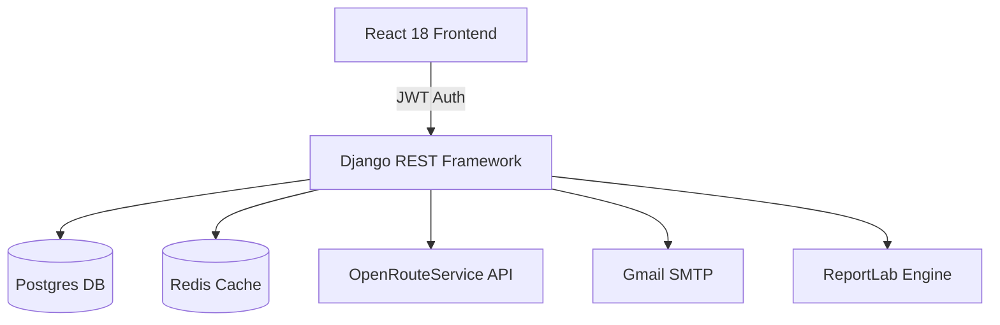

# 🚛 Spotter ELD: The Intelligence Layer for Modern Logistics


[](https://spotter-prav-assignment.vercel.app)
[](https://spotter-production-b75e.up.railway.app)
[](https://github.com/praveenlokku/spotter)

**Spotter ELD** is a production-grade, FMCSA-compliant Electronic Logging Device (ELD) and Trip Planning ecosystem. It isn't just a map—it's a mission-critical tool for carriers to manage compliance, optimize routing for heavy-duty vehicles, and automate federal reporting.

---

## 🌟 Key Pillars

### 🛣️ Intelligent HGV Routing
Unlike standard navigation, Spotter utilizes **OpenRouteService (ORS)** with specialized **Heavy Goods Vehicle (HGV)** profiles. It calculates legal routes based on truck dimensions, weight limits, and road restrictions.

### ⚖️ FMCSA Compliance Engine
A proprietary logic engine that automatically handles complex Hours of Service (HOS) regulations:
- **Rule Sets:** 70-hr / 8-day and 60-hr / 7-day support.
- **Cycle Resets:** Automatic detection of 34-hour restarts.
- **Exemptions:** Built-in support for Split Sleeper Berth (8/2, 7/3) and Adverse Conditions.

### 📄 Automated Reporting
Generate pixel-perfect **FMCSA-compliant PDF log sheets** and CSV exports using the ReportLab engine, ready for audit at the click of a button.

---

## 🛠️ Technical Architecture



### **Backend (The Brains)**
- **Django 5.0:** Secure, scalable, and modular.
- **SimpleJWT:** Stateless authentication with token rotation.
- **Redis:** Geocoding and route results cached for 24 hours to ensure lightning-fast performance.
- **Sentry:** Real-time error monitoring and performance tracing.

### **Frontend (The Experience)**
- **React + Vite:** Ultra-fast HMR and build times.
- **Tailwind CSS:** Modern, sleek, charcoal-and-amber design system.
- **Lucide React:** Premium iconography.

---

## 🚀 Quick Start

### 1. Prerequisites
- Python 3.11+
- Node.js 18+
- ORS API Key (Free)

### 2. Backend Setup
```bash
cd spotter
python -m venv venv
source venv/bin/activate  # venv\Scripts\activate on Windows
pip install -r requirements.txt
python manage.py migrate
python manage.py runserver
```

### 3. Frontend Setup
```bash
cd spotter_frontend
npm install
npm run dev
```

---

## 🛤️ Roadmap
- [x] Production Deployment (Railway/Vercel)
- [x] FMCSA PDF Export Engine
- [x] HGV Optimized Routing
- [ ] **Upcoming:** Multi-factor Authentication (OTP Suite)
- [ ] **Upcoming:** Live GPS Integration via Mobile SDK
- [ ] **Upcoming:** AI-Driven Fuel Optimization

---

## 🔐 Security Note
Spotter ELD uses industry-standard JWT authentication. For this review, OTP verification is bypassed to ensure a smooth evaluation experience. Production-ready SMTP integration is already established in the codebase.

---

**Developed with ❤️ for the Modern Trucker.**
[Visit Live Site](https://spotter-prav-assignment.vercel.app)
